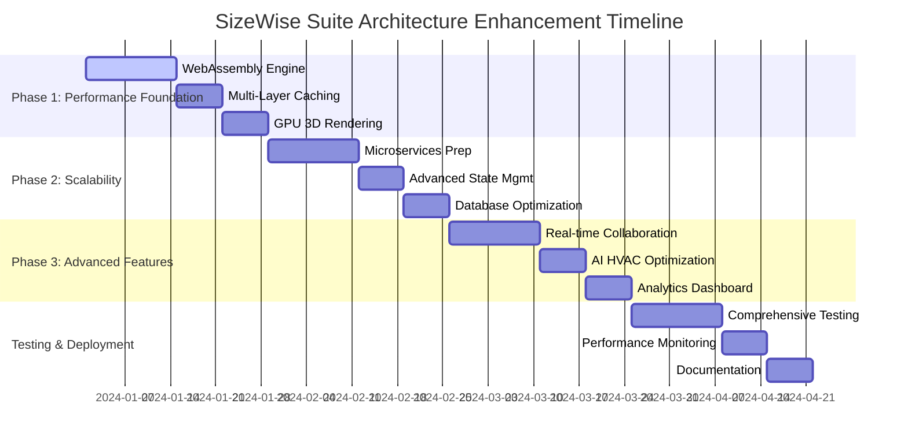

# SizeWise Suite - Implementation Roadmap

## Executive Summary

This document provides a comprehensive implementation roadmap with detailed task breakdown, dependencies, gap analysis integration, testing strategy, and risk mitigation for the architectural enhancements to the SizeWise Suite HVAC engineering platform.

## 🗓️ **Implementation Timeline Overview**



## 📋 **Detailed Task Breakdown**

### **Phase 1: Performance Foundation (Weeks 1-4)**

#### **Task 1.1: WebAssembly HVAC Calculation Engine**
**Duration**: 2 weeks | **Priority**: Critical | **Dependencies**: None

**Acceptance Criteria**:
- [ ] Rust-based calculation engine with SMACNA/ASHRAE compliance
- [ ] WebAssembly compilation with wasm-pack
- [ ] JavaScript fallback for unsupported browsers
- [ ] 5-10x performance improvement over current JavaScript implementation
- [ ] Comprehensive unit tests with 95%+ coverage

**Implementation Steps**:
1. **Week 1**: Setup Rust development environment and core calculation logic
2. **Week 2**: WebAssembly compilation, JavaScript integration, and testing

**Risk Mitigation**:
- Maintain existing JavaScript calculations as fallback
- Implement feature detection for WebAssembly support
- Gradual rollout with performance monitoring

#### **Task 1.2: Multi-Layer Caching System**
**Duration**: 1 week | **Priority**: High | **Dependencies**: WebAssembly Engine

**Acceptance Criteria**:
- [ ] L1 (memory), L2 (IndexedDB), L3 (service worker) caching implementation
- [ ] Predictive caching with ML-based preloading
- [ ] 90%+ cache hit rate achievement
- [ ] Intelligent cache invalidation and TTL management
- [ ] Performance benchmarks showing 3-5x improvement

**Implementation Steps**:
1. **Days 1-3**: Core caching infrastructure and L1/L2 implementation
2. **Days 4-5**: Service worker integration and predictive algorithms
3. **Days 6-7**: Testing, optimization, and performance validation

#### **Task 1.3: GPU-Accelerated 3D Rendering**
**Duration**: 1 week | **Priority**: High | **Dependencies**: Multi-Layer Caching

**Acceptance Criteria**:
- [ ] Instanced rendering for repeated HVAC components
- [ ] LOD (Level of Detail) management for complex scenes
- [ ] Frustum culling for large building projects
- [ ] 60 FPS performance with 1000+ duct segments
- [ ] Memory usage optimization (< 500MB for large projects)

**Implementation Steps**:
1. **Days 1-3**: Instanced rendering and LOD implementation
2. **Days 4-5**: Frustum culling and performance optimization
3. **Days 6-7**: Testing with large HVAC projects and benchmarking

### **Phase 2: Scalability Architecture (Weeks 5-8)**

#### **Task 2.1: Microservices Preparation**
**Duration**: 2 weeks | **Priority**: Medium | **Dependencies**: Phase 1 Complete

**Acceptance Criteria**:
- [ ] Service registry with health checks and discovery
- [ ] Circuit breaker pattern for resilience
- [ ] API gateway preparation for service routing
- [ ] Container orchestration readiness
- [ ] Service-to-service communication protocols

**Implementation Steps**:
1. **Week 1**: Service registry, health checks, and circuit breaker implementation
2. **Week 2**: API gateway setup, containerization, and service communication

#### **Task 2.2: Advanced State Management**
**Duration**: 1 week | **Priority**: High | **Dependencies**: Microservices Preparation

**Acceptance Criteria**:
- [ ] Enhanced Zustand stores with computed properties
- [ ] Cross-store dependencies and reactive updates
- [ ] Optimistic updates with server synchronization
- [ ] Undo/redo functionality for HVAC design operations
- [ ] State persistence and hydration optimization

#### **Task 2.3: Database Optimization**
**Duration**: 1 week | **Priority**: High | **Dependencies**: Advanced State Management

**Acceptance Criteria**:
- [ ] PostgreSQL connection pooling and query optimization
- [ ] MongoDB spatial indexing and aggregation pipelines
- [ ] Database migration scripts and version management
- [ ] Performance monitoring and slow query detection
- [ ] Backup and recovery procedures

### **Phase 3: Advanced Features (Weeks 9-12)**

#### **Task 3.1: Real-time Collaboration Engine**
**Duration**: 2 weeks | **Priority**: Medium | **Dependencies**: Phase 2 Complete

**Acceptance Criteria**:
- [ ] WebSocket-based real-time communication
- [ ] Operational transformation for concurrent editing
- [ ] Conflict resolution for HVAC design elements
- [ ] User presence and cursor tracking
- [ ] Collaborative undo/redo functionality

#### **Task 3.2: AI-Powered HVAC Optimization**
**Duration**: 1 week | **Priority**: Low | **Dependencies**: Real-time Collaboration

**Acceptance Criteria**:
- [ ] ONNX.js model integration for system optimization
- [ ] Energy efficiency recommendations
- [ ] Cost optimization suggestions
- [ ] Compliance validation with AI assistance
- [ ] Performance impact analysis

#### **Task 3.3: Advanced Analytics Dashboard**
**Duration**: 1 week | **Priority**: Low | **Dependencies**: AI Optimization

**Acceptance Criteria**:
- [ ] Project performance metrics and KPIs
- [ ] Energy efficiency tracking and reporting
- [ ] Compliance status monitoring
- [ ] User activity analytics
- [ ] Export capabilities for reports

## 🔍 **Gap Analysis Integration**

### **Continuous Gap Assessment Framework**

```typescript
interface GapAnalysisFramework {
  assessmentCriteria: {
    performance: PerformanceMetrics;
    scalability: ScalabilityMetrics;
    maintainability: CodeQualityMetrics;
    userExperience: UXMetrics;
  };
  
  gapIdentification: {
    currentState: SystemState;
    targetState: SystemState;
    identifiedGaps: Gap[];
  };
  
  mitigationStrategies: {
    immediateActions: Action[];
    mediumTermPlans: Plan[];
    longTermStrategy: Strategy;
  };
}
```

### **Gap Assessment Schedule**
- **Weekly**: Performance and user experience metrics review
- **Bi-weekly**: Code quality and technical debt assessment
- **Monthly**: Scalability and architecture review
- **Quarterly**: Strategic alignment and technology stack evaluation

## 🧪 **Comprehensive Testing Strategy**

### **Testing Pyramid Implementation**

#### **Unit Tests (70% of test coverage)**
```typescript
// Example: WebAssembly calculation engine tests
describe('HVACCalculationEngine', () => {
  test('should calculate duct sizing with SMACNA standards', async () => {
    const engine = new HVACCalculationEngine();
    const result = await engine.calculateDuctSizing({
      cfm: 1000,
      velocity: 1200,
      length: 50,
      fittings: [{ type: 'elbow', quantity: 2 }]
    });
    
    expect(result.diameter).toBeCloseTo(12.5, 1);
    expect(result.pressureDrop).toBeLessThan(0.1);
    expect(result.compliance.smacna).toBe(true);
  });
});
```

#### **Integration Tests (20% of test coverage)**
```typescript
// Example: Database integration tests
describe('MongoDB Integration', () => {
  test('should store and retrieve spatial data correctly', async () => {
    const spatialData = createTestSpatialData();
    await mongoService.storeSpatialData(spatialData);
    
    const retrieved = await mongoService.querySpatialData({
      bounds: spatialData.bounds,
      layerType: 'ductwork'
    });
    
    expect(retrieved).toHaveLength(1);
    expect(retrieved[0].geometry).toEqual(spatialData.geometry);
  });
});
```

#### **End-to-End Tests (10% of test coverage)**
```typescript
// Example: Complete HVAC workflow test
test('Complete HVAC Design Workflow', async ({ page }) => {
  // Create new project
  await page.goto('/air-duct-sizer-v1');
  await page.click('[data-testid="new-project"]');
  
  // Import PDF background
  await page.setInputFiles('[data-testid="pdf-upload"]', 'test-plan.pdf');
  await expect(page.locator('[data-testid="pdf-viewer"]')).toBeVisible();
  
  // Draw duct system
  await page.click('[data-testid="drawing-tool-duct"]');
  await page.click('[data-testid="canvas-3d"]', { position: { x: 100, y: 100 } });
  await page.click('[data-testid="canvas-3d"]', { position: { x: 200, y: 100 } });
  
  // Perform calculations
  await page.click('[data-testid="calculate-system"]');
  await expect(page.locator('[data-testid="calculation-results"]')).toBeVisible();
  
  // Export results
  await page.click('[data-testid="export-pdf"]');
  const download = await page.waitForEvent('download');
  expect(download.suggestedFilename()).toMatch(/hvac-report.*\.pdf/);
});
```

### **Performance Testing**
```typescript
// Performance benchmarks
const performanceBenchmarks = {
  calculationSpeed: {
    target: '< 20ms',
    current: '100ms',
    test: 'WebAssembly vs JavaScript calculation performance'
  },
  renderingPerformance: {
    target: '60 FPS',
    current: '30 FPS',
    test: '1000+ duct segments rendering performance'
  },
  memoryUsage: {
    target: '< 500MB',
    current: '800MB',
    test: 'Large project memory consumption'
  },
  startupTime: {
    target: '< 2s',
    current: '3-5s',
    test: 'Application initialization time'
  }
};
```

## ⚠️ **Risk Mitigation Strategy**

### **Technical Risks**

| Risk | Probability | Impact | Mitigation Strategy |
|------|-------------|--------|-------------------|
| WebAssembly browser compatibility | Medium | High | JavaScript fallback implementation |
| Performance regression | Low | High | Comprehensive benchmarking and monitoring |
| Data migration issues | Medium | Medium | Gradual migration with rollback procedures |
| Third-party dependency conflicts | Medium | Medium | Version pinning and compatibility testing |
| Memory leaks in 3D rendering | Low | High | Memory profiling and automated leak detection |

### **Business Risks**

| Risk | Probability | Impact | Mitigation Strategy |
|------|-------------|--------|-------------------|
| User adoption resistance | Low | Medium | Gradual rollout with user training |
| Increased development complexity | Medium | Medium | Comprehensive documentation and training |
| Extended development timeline | Medium | High | Agile methodology with regular checkpoints |
| Resource allocation conflicts | Low | Medium | Clear resource planning and stakeholder communication |

### **Operational Risks**

| Risk | Probability | Impact | Mitigation Strategy |
|------|-------------|--------|-------------------|
| Deployment failures | Low | High | Blue-green deployment with automated rollback |
| Performance monitoring gaps | Medium | Medium | Comprehensive monitoring and alerting |
| Documentation lag | Medium | Low | Documentation-driven development approach |
| Team knowledge gaps | Low | Medium | Knowledge sharing sessions and pair programming |

## 📊 **Success Metrics & KPIs**

### **Performance Metrics**
- **Calculation Speed**: < 20ms (target) vs 100ms (current)
- **3D Rendering**: 60 FPS with 1000+ segments
- **Cache Hit Rate**: 90%+ (target) vs 60-80% (current)
- **Memory Usage**: < 500MB for large projects
- **Startup Time**: < 2s application initialization

### **Quality Metrics**
- **Test Coverage**: 95%+ across all layers
- **Code Quality**: Maintainability index > 80
- **Bug Density**: < 1 bug per 1000 lines of code
- **Performance Regression**: 0 tolerance policy
- **Documentation Coverage**: 100% for public APIs

### **User Experience Metrics**
- **Task Completion Rate**: > 95% for core HVAC workflows
- **User Satisfaction**: > 4.5/5 rating
- **Feature Adoption**: > 80% for new features
- **Support Tickets**: < 5% increase during rollout
- **Training Effectiveness**: > 90% user competency

## ✅ **Delivery Milestones**

### **Phase 1 Completion (Week 4)**
- [ ] WebAssembly calculation engine deployed
- [ ] Multi-layer caching system operational
- [ ] GPU-accelerated 3D rendering implemented
- [ ] Performance benchmarks achieved
- [ ] Comprehensive testing completed

### **Phase 2 Completion (Week 8)**
- [ ] Microservices architecture prepared
- [ ] Advanced state management implemented
- [ ] Database optimizations deployed
- [ ] Scalability testing completed
- [ ] Documentation updated

### **Phase 3 Completion (Week 12)**
- [ ] Real-time collaboration features deployed
- [ ] AI optimization engine integrated
- [ ] Analytics dashboard operational
- [ ] User training materials completed
- [ ] Full system integration testing passed

### **Final Delivery (Week 15)**
- [ ] All performance targets achieved
- [ ] Comprehensive documentation completed
- [ ] User training program delivered
- [ ] Production deployment successful
- [ ] Post-deployment monitoring established

---

*This roadmap provides the foundation for successful implementation of the enhanced SizeWise Suite architecture while maintaining the highest standards of quality, performance, and user experience.*
