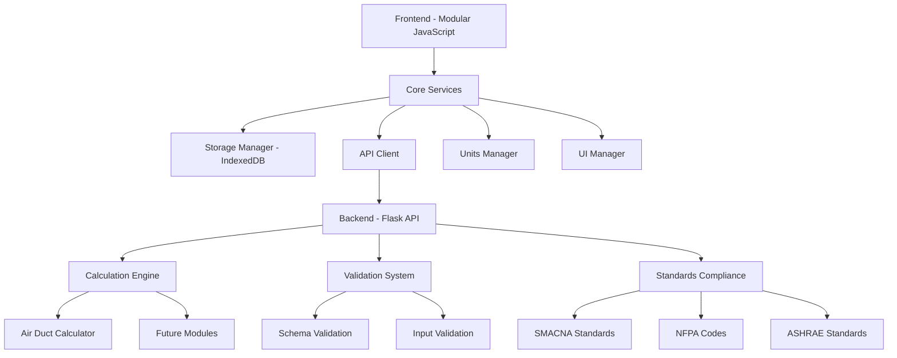

# SizeWise Suite Documentation

Welcome to SizeWise Suite, a comprehensive modular HVAC engineering and estimating platform designed for mechanical engineers, estimators, QA professionals, and project managers.

## What is SizeWise Suite?

SizeWise Suite is an **offline-first**, **modular platform** that unifies duct sizing, vent design, and cost estimating in a single workspace. Built with modern web technologies, it provides:

- **Standards Compliance**: Full compliance with SMACNA, NFPA, and ASHRAE standards
- **Offline-First Design**: Work anywhere, anytime without internet connectivity
- **Bidirectional Unit Conversion**: Seamless Imperial/SI unit support
- **Modular Architecture**: Extensible design for future HVAC modules
- **Progressive Web App**: Install and use like a native application

## Core Modules

### 🌬️ Air Duct Sizer
Calculate optimal duct sizes for HVAC systems with SMACNA compliance checking, friction loss analysis, and velocity validation.

### 🔥 Grease Duct Sizer *(Coming Soon)*
Design grease exhaust systems with NFPA 96 compliance and fire safety considerations.

### 🚗 Engine Exhaust Sizer *(Coming Soon)*
Size engine exhaust systems for parking garages and mechanical rooms.

### 🔥 Boiler Vent Sizer *(Coming Soon)*
Calculate boiler vent requirements with code compliance checking.

### 💰 Estimating App *(Coming Soon)*
Generate accurate cost estimates for HVAC projects with material and labor calculations.

## Key Features

### ✅ Standards Compliance
- **SMACNA**: Sheet Metal and Air Conditioning Contractors' National Association standards
- **NFPA**: National Fire Protection Association codes
- **ASHRAE**: American Society of Heating, Refrigerating and Air-Conditioning Engineers standards

### 🔄 Unit Conversion
- Seamless conversion between Imperial and Metric units
- Temperature, pressure, flow rate, and dimensional conversions
- Automatic unit detection and validation

### 💾 Offline Functionality
- Complete offline operation with IndexedDB storage
- Project and calculation persistence
- Progressive Web App (PWA) capabilities
- No internet required for core functionality

### 📱 Modern Interface
- Responsive design for desktop, tablet, and mobile
- Intuitive user interface with real-time validation
- Dark/light mode support
- Accessibility compliant

## Quick Start

1. **[Install SizeWise Suite](getting-started/installation.md)** on your device
2. **[Follow the Quick Start Guide](developer-guide/post-migration-quick-start.md)** to perform your first calculation
3. **[Explore the User Guide](user-guide/overview.md)** for detailed feature documentation

## Architecture Overview

## Technology Stack

- **Frontend**: Modular JavaScript, Progressive Web App (PWA)
- **Backend**: Python Flask with comprehensive calculation engines
- **Storage**: IndexedDB for offline data persistence
- **Validation**: Pydantic schemas with JSONSchema validation
- **Testing**: Jest (frontend) + pytest (backend)
- **Documentation**: MkDocs with Material theme

## Getting Help

- **[User Guide](user-guide/overview.md)**: Comprehensive usage documentation
- **[API Reference](api/overview.md)**: Technical API documentation
- **[Developer Guide](developer/architecture.md)**: Architecture and development information
- **[Examples](examples/basic-calculations.md)**: Practical usage examples

## Contributing

SizeWise Suite is designed to be extensible and welcomes contributions. See our **[Contributing Guide](developer/contributing.md)** for information on:

- Adding new calculation modules
- Improving existing functionality
- Reporting bugs and requesting features
- Development setup and guidelines

## License

SizeWise Suite is released under the MIT License. See the [LICENSE](https://github.com/sizewise-suite/sizewise-suite/blob/main/LICENSE) file for details.

---

*Built with ❤️ for the HVAC engineering community*
