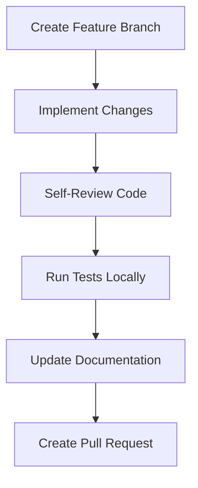
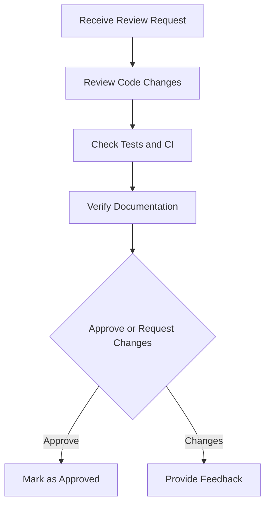
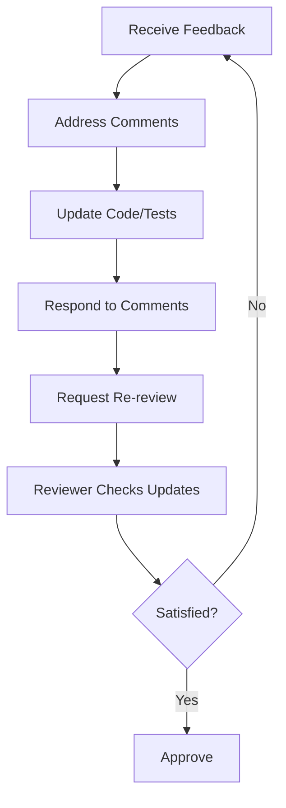

# Code Review Process

**📍 Navigation:** [Documentation Home](../README.md) > [Project Management](README.md) > Review Process

This document defines the comprehensive code review process for SizeWise Suite, ensuring code quality, knowledge sharing, and team collaboration.

## Review Philosophy

Our code review process is built on these principles:
- **Quality First**: Maintain high code quality and system reliability
- **Knowledge Sharing**: Spread knowledge across the team
- **Continuous Learning**: Use reviews as learning opportunities
- **Constructive Feedback**: Provide helpful, actionable feedback
- **Efficiency**: Balance thoroughness with development velocity

## Review Types

### 1. Standard Code Review
**Scope**: Regular feature development, bug fixes, and improvements
**Reviewers**: 2 team members (1 senior, 1 peer)
**Timeline**: 48 hours for initial review, 24 hours for follow-ups

### 2. Architecture Review
**Scope**: Major architectural changes, new system components
**Reviewers**: Architecture team + 2 senior developers
**Timeline**: 72 hours for initial review, includes design discussion

### 3. Security Review
**Scope**: Authentication, authorization, data handling, external integrations
**Reviewers**: Security-focused team member + 1 senior developer
**Timeline**: 48 hours, may require additional security testing

### 4. Performance Review
**Scope**: Performance-critical code, database queries, algorithms
**Reviewers**: Performance specialist + domain expert
**Timeline**: 48 hours, includes performance testing verification

## Review Checklist

### Code Quality
- [ ] **Readability**: Code is clear and self-documenting
- [ ] **Maintainability**: Easy to modify and extend
- [ ] **Consistency**: Follows established patterns and conventions
- [ ] **Simplicity**: Avoids unnecessary complexity
- [ ] **Error Handling**: Proper error handling and edge cases

### Functionality
- [ ] **Requirements**: Meets specified requirements
- [ ] **Edge Cases**: Handles boundary conditions appropriately
- [ ] **Integration**: Works correctly with existing systems
- [ ] **Performance**: Meets performance requirements
- [ ] **Security**: Follows security best practices

### Testing
- [ ] **Coverage**: Adequate test coverage (minimum 80%)
- [ ] **Quality**: Tests are meaningful and maintainable
- [ ] **Types**: Appropriate mix of unit, integration, and E2E tests
- [ ] **Edge Cases**: Tests cover error conditions and boundaries
- [ ] **Documentation**: Test intent is clear

### Documentation
- [ ] **Code Comments**: Complex logic is explained
- [ ] **API Documentation**: Public interfaces are documented
- [ ] **README Updates**: Documentation reflects changes
- [ ] **Migration Guides**: Breaking changes include migration info
- [ ] **Changelog**: Significant changes are documented

## Review Process Flow

### 1. Pre-Review (Author)


**Author Responsibilities**:
- Complete self-review before requesting review
- Ensure all tests pass locally
- Update relevant documentation
- Provide clear PR description and context

### 2. Initial Review (Reviewers)


**Reviewer Responsibilities**:
- Review within specified timeline
- Provide constructive, actionable feedback
- Focus on important issues over minor style preferences
- Verify tests and documentation

### 3. Feedback Loop (Author + Reviewers)


### 4. Final Approval and Merge
- All required approvals received
- All automated checks pass
- All review comments resolved
- Merge using appropriate strategy

## Review Guidelines

### For Authors

**Before Requesting Review**:
```bash
# Self-review checklist
git diff main...HEAD  # Review all changes
npm test              # Run all tests
npm run lint          # Check code style
npm run build         # Verify build works
```

**Writing Good PR Descriptions**:
- Explain the "why" behind changes
- Highlight areas that need special attention
- Include screenshots for UI changes
- Link to related issues or documentation

**Responding to Feedback**:
- Address all comments, even if just to acknowledge
- Ask for clarification when feedback is unclear
- Push back respectfully when you disagree
- Thank reviewers for their time and insights

### For Reviewers

**Review Priorities** (in order):
1. **Correctness**: Does the code work as intended?
2. **Security**: Are there security vulnerabilities?
3. **Performance**: Will this impact system performance?
4. **Maintainability**: Is the code easy to understand and modify?
5. **Style**: Does it follow coding conventions?

**Providing Effective Feedback**:
```
❌ Bad: "This is wrong"
✅ Good: "This function doesn't handle null values. Consider adding a null check or using optional chaining."

❌ Bad: "Use better variable names"
✅ Good: "Consider renaming 'data' to 'calculationResults' for clarity"

❌ Bad: "This won't work"
✅ Good: "This approach might cause issues with concurrent requests. Have you considered using a lock or queue?"
```

**Review Comment Types**:
- **🚨 Blocking**: Must be fixed before merge
- **💡 Suggestion**: Recommended improvement
- **❓ Question**: Seeking clarification
- **🎨 Style**: Minor style/formatting issue
- **👍 Praise**: Acknowledge good work

### Review Etiquette

**Do's**:
- Be respectful and constructive
- Explain the reasoning behind suggestions
- Acknowledge good code and clever solutions
- Focus on the code, not the person
- Be specific and actionable in feedback

**Don'ts**:
- Don't be overly critical or harsh
- Don't focus only on style issues
- Don't approve without actually reviewing
- Don't let perfect be the enemy of good
- Don't ignore the bigger picture for minor details

## Special Review Scenarios

### Large Pull Requests
**Handling Strategy**:
- Break into smaller PRs when possible
- Focus on architectural and design issues first
- Use draft PRs for work-in-progress reviews
- Consider pair programming for complex changes

**Review Approach**:
- Start with high-level architecture review
- Focus on critical paths and core logic
- Use multiple review sessions if needed
- Document decisions and trade-offs

### Urgent Hotfixes
**Expedited Process**:
- Single reviewer approval sufficient
- Focus on fix correctness and minimal impact
- Require immediate testing verification
- Schedule follow-up review for additional improvements

### External Contributions
**Enhanced Process**:
- Assign experienced reviewer as mentor
- Provide extra context and guidance
- Focus on teaching and knowledge transfer
- Be patient with back-and-forth iterations

## Review Metrics and Improvement

### Key Metrics
- **Review Turnaround Time**: Average time from request to approval
- **Review Coverage**: Percentage of code changes reviewed
- **Defect Detection Rate**: Issues caught in review vs. production
- **Review Participation**: Distribution of review load across team

### Continuous Improvement
- **Weekly Review Retrospectives**: Discuss process improvements
- **Review Quality Assessment**: Evaluate effectiveness of reviews
- **Tool and Process Updates**: Adapt based on team feedback
- **Training and Guidelines**: Update based on common issues

## Tools and Automation

### GitHub Integration
- **Required Reviews**: Enforce minimum reviewer requirements
- **Code Owners**: Automatic reviewer assignment
- **Status Checks**: Automated quality gates
- **Review Templates**: Standardized review checklists

### Automated Checks
```yaml
# .github/workflows/review.yml
- name: Code Quality Checks
  run: |
    npm run lint
    npm run type-check
    npm run test:coverage
    npm run security-scan
```

### Review Tools
- **GitHub Reviews**: Primary review interface
- **VS Code Extensions**: Enhanced diff viewing
- **Automated Suggestions**: Style and security fixes
- **Performance Profiling**: Automated performance checks

## Escalation Process

### Disagreements
1. **Discussion**: Author and reviewer discuss the issue
2. **Team Input**: Bring to team discussion if needed
3. **Architecture Review**: Escalate to architecture team
4. **Final Decision**: Tech lead makes final call

### Blocked Reviews
1. **Identify Blocker**: Determine what's preventing approval
2. **Set Timeline**: Establish deadline for resolution
3. **Alternative Reviewers**: Assign additional reviewers if needed
4. **Management Escalation**: Involve management for persistent blocks

---

## Related Documentation

- **[PR Guidelines](pr-guidelines.md)**: Pull request creation and management
- **[Contributing Guidelines](../developer-guide/contributing.md)**: Overall contribution process
- **[Coding Standards](../developer-guide/contributing.md#coding-standards)**: Code style and conventions
- **[Testing Guidelines](../developer-guide/testing.md)**: Testing requirements and standards

**📍 Navigation:** [Documentation Home](../README.md) > [Project Management](README.md) > Review Process
